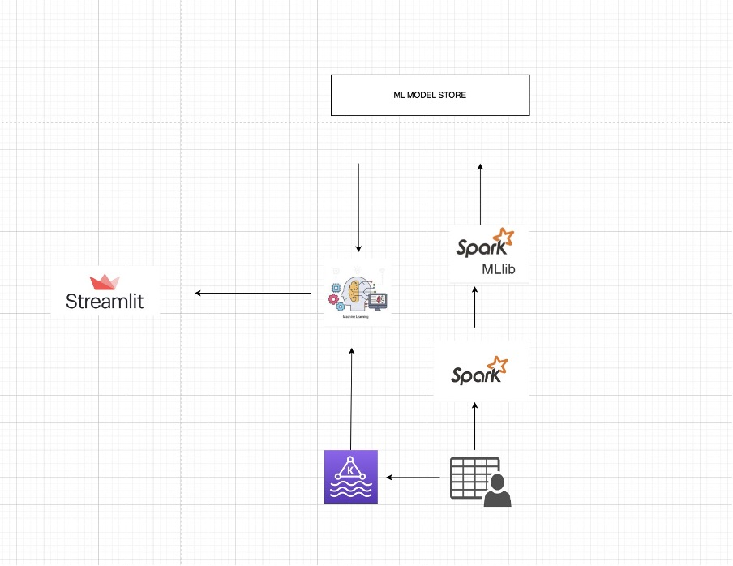

---

## Name

**Real-Time Credit Card Fraud Detection**

## Description

Real-Time Credit Card Fraud Detection is developed to detect credit card fraud in real time using Kafka as a simulator to simulate data,
Spark Streaming to stream kafka data and load it in a machine learning engine to predict if it is a fraud or legit transaction on a Streamlit dashboard. 

## Files Information

1. File name starting with the model\_ are trained models.
2. app.py is a main file to start Streamlit Dashboard.
3. consumer.py file reads data from kakfa topic and push it to the new topic called prediction.
4. credircard.csv is a dataset.
5. **fraud_dect.ipynb is the most important file, in which EDA and Model tranning is perfromed**.
6. kakfa_producer.py is file which read data from csv and push it to kafka topic.

## Installation

$ brew cask install java 
$ brew install kafka

## Usage and Run

Step 1. zookeeper-server-start /usr/local/etc/kafka/zookeeper.properties  
Step 2. kafka-server-start /usr/local/etc/kafka/server.properties  
Step 3. kafka-topics.sh --zookeeper localhost:2181 --create --topic spark03 --replication-factor 1 -- partitions 2  
Step 4. kafka-topics.sh --bootstrap-server localhost:9092 --create --topic prediction --replication-factor 1 -- partitions 2  
Step 5. Run kafa_producer.py in the project directory with command 'python3 kafka_producer.py'  
Step 6. Run spark-submit --packages org.apache.spark:spark-sql-kafka-0-10_2.12:3.4.0 consumer.py in new terminal  
Step 7. Rund streamlit run app.py on the new terminal  

## Important Notes
 1. The requirements.txt file should list all Python libraries that require for the project, and they will be installed using: 
    **pip install -r requirements.txt**

 2. Please check fraud_dect.ipynb on databricks which is the main file for the course, model tranning and EDA is performed on it.
